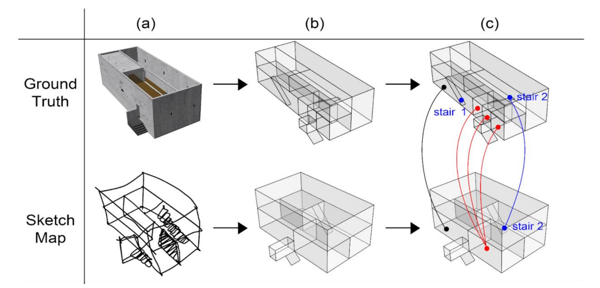
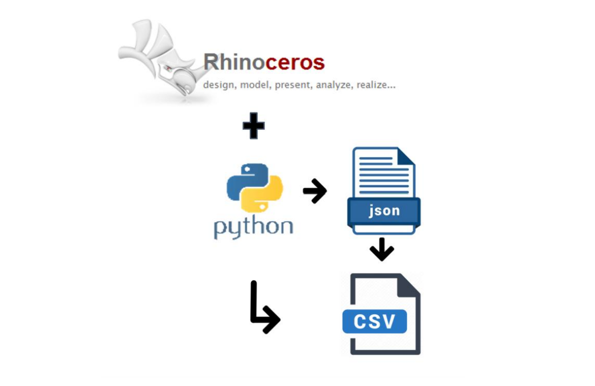

# 3D-Sketch-Map-Analysis

  ## Background
  As a part of my master's program in Geoinformatics and Spatial Data Science  at the University of Münster, I started my internship within a collaborative project between **IFGI and ETH Zurich** research institute at Switzerland, spanning from 1st April 2023 to 30th September 2023. This internship revolved around the **“3D Sketch Maps”** project.

  ## SketchMap Creation
  To enhance the assessment of the sketch maps, we expanded upon an existing approach for analyzing 2D sketch maps and integrated it with the formalized technique of portraying buildings as a collection of convex spaces, as established in the architectural framework of Space Syntax. Our method involved two primary steps. Initially, we redrew both the sketch map and the ground-truth building model within Rhino using a standardized set of geometric shapes: cuboids to represent rooms and planes to represent staircases. Subsequently, we manually linked/aligned each cuboid and plane in the ground truth to a corresponding object in the sketch map.

  

  ## Spatial Analysis
  After acquiring the annotated maps, I have proceeded to examine various spatial relationships within these sketch maps. Initially, focused on extracting connectivity information, specifically between each cuboid-cuboid, cuboid-plane, and plane-plane pairs. To achieve this, a few custom function has been developed and seamlessly integrated into the Rhino software using Python. These custom function served the purpose of retrieving connectivity information, such as identifying the types of connections between cuboids and planes. It determined whether they shared an edge, surface, or point.  Additionally, the function will also gathered topological information, discerning relationships like "inside" and "outside." For instance, it determined which plane, such as a staircase, was positioned inside or outside a particular cuboid, such as a room. In this manner, my script **'Connection_info.py'** systematically collected comprehensive information from each cuboid and plane featured in the annotated sketch maps. 

  ## Completeness and Generalization:
  We systematically identified and quantified specific scenarios during which a participant exhibited the following behaviors:
    (a) Failure to depict an object from the ground truth in the sketch map, which represents a case of incompleteness.
    (b) Depiction of multiple objects (e.g., several rooms or cuboids) as a single object (cuboid) in the sketch map, illustrating a common instance of generalization in sketch map drawing. 
  When you run the script **'Generalization.py'** it will produce results with genralization and completeness informations.

  ## Workflow 

  The workflow for our analysis involved the development and implementation of a custom Python function within the Rhino software environment. This function was designed to systematically process the annotated 3D sketch maps, extracting valuable insights and spatial information. The steps can be outlined as follows:
    1) Development of a custom Python function within Rhino. 
    2) Examination of the annotated 3D sketch maps. 
    3) Generation of results in JSON file format. 
    4) Computation of generalization and completeness metrics. 
    5) Retrieval of final statistical outcomes in the form of a CSV file.

  

    
  

  

  ## Requirements
  - Rhino software (Any version)
  - Python 3.6 or higher
 
  ## Usage

  Steps to run the scripts in the 'Analysis_Scripts' folder.
  - Install Rhino software.
  - Open the the 3d model (.3dm file) from the 'Sample_Rhinofile' folder in Rhino.
  - Then Check the layers and find the Original Map and Sketch map layer names, which want to be analysed.
  - Next go to 'Tools' in the top menu and click 'PhythonScript > Edit'
  - Now python editor will appear. Open up the 'generalization.py and Connection_info.py' file
  - You can use 'Delete_floors.py' when there are lots layer and you want to delete a particular attribute.
  - There is no specific order to run the scripts. Every can ran independently.
  - If You ran the 'Generlaization.py' it will ask for BaseLayer and SketchLayer names in the Rhino UI. Once You Entered the layer name  it will give .Json file as result which contains alignment, genralization and satistics informations.
  - If you ran the 'Connection_info.py'. Unlike previous one it will ask for the one layer name. As result it will give another json file with connection informations such point connections, cuboid connections, surface conections and also it connection types (whether it shares edge, point or surface). You can enter the Layer name one by one get results of both sketch map and base map.
  - And 'Final_Satistics.py' is a script to collect the satistical info from the generalization results and convert it into CSV file. It can used if you have more genralization inputs.

